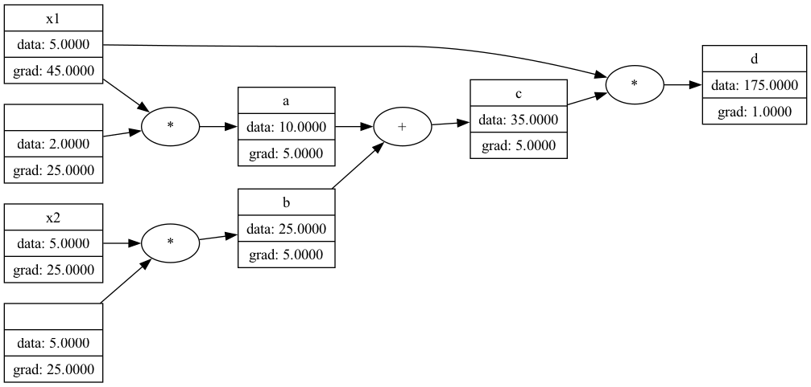

# micrograd

reimplementation and experimentation playground for the scalar valued autograd engine micrograd with computational graph visualizer

## structure
* **`micrograd/engine.py`**: `Value` class with scalar-level auto diff and backprop
* **`micrograd/nn.py`**: nn building blocks (`Neuron`, `Layer`, `MLP`)
* **`micrograd/utils.py`**: graphviz helpers (`draw_comp_graph`) to visualize computational graps
* **`playground.ipynb`**: notebook demonstrating 2D binary classification (`make_circles`, `make_moons`) and decision boundaries
## example
```python
from micrograd.engine import Value
from micrograd.nn import MLP
from micrograd.utils import draw_compgraph

# initialize a 2-layer MLP (2 inputs, 16 hidden neurons, 1 output)
model = MLP(2, [16, 1])

# forward pass
x = [Value(2.0), Value(3.0)] # ;x.label="name"
out = model(x)

# backprop
out.backward()

#draw computational graph
draw_compgraph(out)

